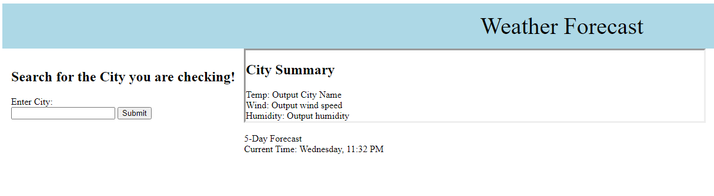
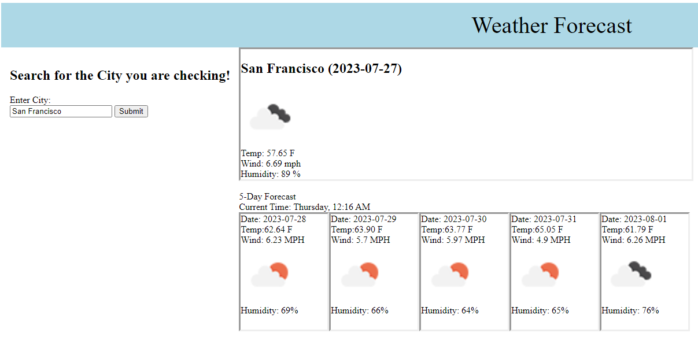

# DT-Weather-API

This project is designed to showcase the ability to search different cities and populate the current weather.
In addition, it will also provide a 5 day forecast that provides the attributes of temperature, wind, and humidity.

When you first land on that page, it will be shown as this:

Once you search the specified city, it would be displayed as this:

Deployed URL: https://dtrieu1.github.io/DT-Weather-API/
